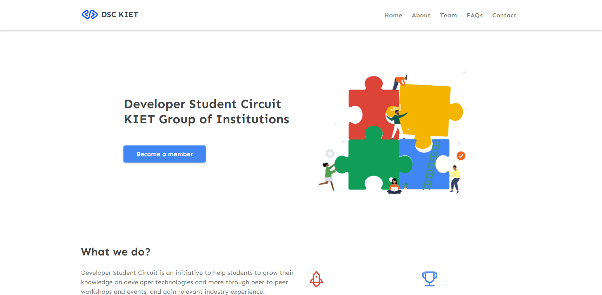

<p align="center">
	
	</p>


<p align="center">
  
</p>

This repository contains the assets required to build the [DSC KIET Website](https://dsckiet.com/). We're glad that you want to contribute!

# DSC KIET

<h4>Developer Student Circuit is an initiative to help students to grow their knowledge on developer technologies and more through peer to peer workshops and events, and gain relevant industry experience.</h4>
<h4 align="left"> We try to engage student developers through our hack, events, codelabs, and meetups.

The motive is to create an ecosystem of programmers & developers in the campus by helping them to learn and build projects. </h4>

# An overview of the website




## Prerequisites

To use this repository, you need the following installed locally:

-  Knowledge about github.
- [Git](https://git-scm.com)
- [VS Code](https://code.visualstudio.com/download). 
-  Have basic knowledge of git commands. 

## Instructions to run

```
 Fork the repository
```
Fork this repository by clicking on the fork button on the top of the page. This will create a copy of this repository in your account.


```
 Clone the repository
```
Now clone the forked repository to your machine. Go to your GitHub account, open the forked repository, click on the code button and then click the _copy to clipboard_ icon.

Open a terminal and run the following git command:

```
git clone "url you just copied"
```

where "url you just copied" (without the quotation marks) is the url to this repository (your fork of this project). See the previous steps to obtain the url.

For example:


```
git clone https://github.com/this-is-you/website.git
```

where `this-is-you` is your GitHub username. Here you're copying the contents of the first-contributions repository on GitHub to your computer.

```
A folder will be installed
```


## Create a branch

Change to the repository directory on your computer (if you are not already there):


Now create a branch using the `git checkout` command:

```
git checkout -b <your-new-branch-name>
```
For example:

```
git checkout -b add-new-file
```

```
open the folder in VS code with terminal
```
```
Use command => <npm install> 
```
this will install all the package that are required for run the project.

```
Use command => <npm start>  
```
to open the site in browser.

```
You are ready to make changes, give it a go 👍
```

## 🙏 Support

This project needs a ⭐️ from you. Don't forget to leave a star ⭐️

[](https://forthebadge.com)
[](https://www.linkedin.com/pulse/20-ways-make-someone-smile-ingrid-kelada/?trk=read_related_article-card_title)
 
<br>

<p align="center">
	Made during 🌙 by DSC KIET
</p>

<!-- <!-- ## Make necessary changes and commit those changes

Now open add or edit file in a text editor. Add code for any existing algorithm in other language or add some new algorithms. Make sure to update correspond README.md file if needed. Now, save the file. -->

<!-- If you go to the project directory and execute the command `git status`, you'll see there are changes.

Add those changes to the branch you just created using the `git add` command:

```
git add "name of the file you add or edit"
```

Now commit those changes using the `git commit` command:

```
git commit -m "Add message for the change"
```

## Push changes to GitHub

Push your changes using the command `git push`:

```
git push origin <add-your-branch-name>
```

replacing `<add-your-branch-name>` with the name of the branch you created earlier.

## Submit your changes for review

If you go to your repository on GitHub, you'll see a `Contribute` button. Click on that button.


click on `Open pull request`.


click on `Create pull request`.


click on `Create pull request`.

## Where to go from here?

Congrats! You just completed the standard _fork -> clone -> edit -> pull request_ workflow that you'll encounter often as a contributor!

## 💪 Thanks to all Contributors

Thanks a lot for spending your time helping FOSSC grow. Thanks a lot! Keep rocking 🍻

[](https://github.com/FOSS-Community/website-fossc)

 -->
